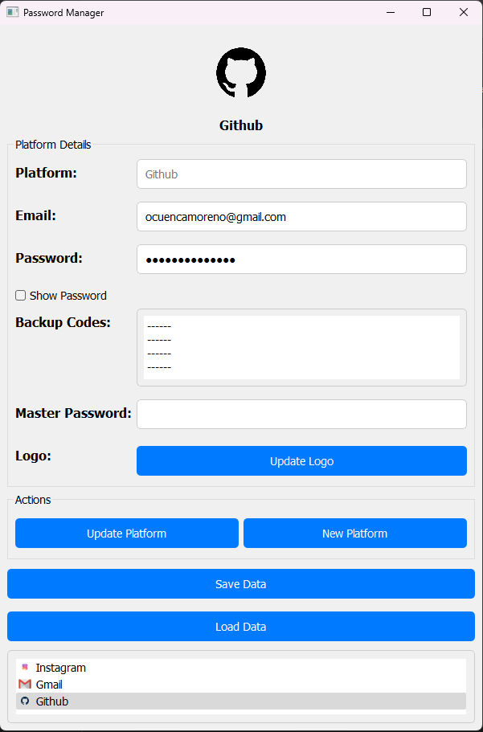

# Password Manager Application

This Password Manager application is a secure and user-friendly tool for managing and encrypting your passwords, backup codes, and related information. Built using Python and PyQt5, it ensures your sensitive data is safely stored and easily accessible.

## Features

- **Secure Storage**: Encrypts passwords using Scrypt and AES algorithms.
- **User Interface**: Intuitive UI built with PyQt5.
- **Platform Management**: Add, update, and display platforms with email, password, backup codes, and logos.
- **Persistence**: Data persists between sessions, protected by a master password.
- **Error Handling**: Robust error handling and user feedback.

## Screenshot

<p align="center">
  
</p>

## Installation

1. **Clone the repository:**
   ```bash
   git clone https://github.com/yourusername/password-manager.git
   cd password-manager
   ```

2. **Create and activate a virtual environment:**
   ```bash
   python -m venv env
   source env/bin/activate   # On Windows use `env\Scriptsctivate`
   ```

3. **Install dependencies:**
   ```bash
   pip install -r requirements.txt
   ```

## Usage

1. **Run the application:**
   ```bash
   python main.py
   ```

2. **Adding a Platform:**
   - Enter the platform name, email, password, and backup codes.
   - Optionally, choose a logo for the platform.
   - Enter the master password and click "Add Platform".

3. **Updating a Platform:**
   - Select a platform from the list.
   - Modify the details as needed and click "Update Platform".

4. **Saving and Loading Data:**
   - Click "Save Data" to save your encrypted data.
   - Click "Load Data" to load data, entering the master password when prompted.

## Contributing

Contributions are welcome! Please fork this repository and submit a pull request for any improvements or bug fixes.

## License

This project is licensed under the MIT License. See the [LICENSE](LICENSE) file for details.

## Acknowledgements

- [PyQt5](https://www.riverbankcomputing.com/software/pyqt/intro) for the user interface components.
- [cryptography](https://cryptography.io/en/latest/) library for encryption.
